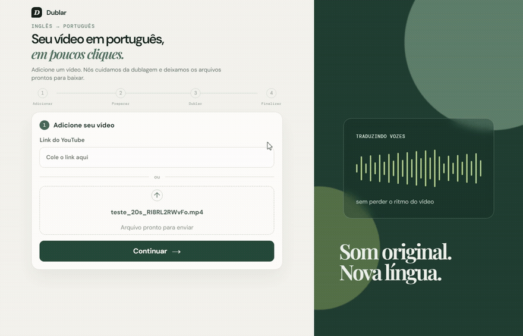

# OpenDub

Transforma um vídeo em inglês em vídeo dublado em português — sem precisar entender
nada de programação. Cole um link do YouTube ou escolha um vídeo do computador,
clique em um botão e baixe o resultado.

100% gratuito e de código aberto. Veja a [página de apresentação do projeto](https://opendub.larchertech.com)
para uma visão geral, demonstração em vídeo e o link de download.

## O que ele faz

- Traduz a fala do inglês para o português mantendo o vídeo original intacto: os
  cortes, a música e os efeitos continuam exatamente onde estavam.
- A voz dublada é sintética (não é a voz original clonada), mas dá pra ativar a opção
  **Manter entonação original** pra aproximar o timbre da voz de quem fala no vídeo.
- Também gera, se você quiser, a legenda (`.srt`) e a transcrição em texto puro
  (`.txt`) do áudio original.

## Como usar

1. Abra o aplicativo.
2. Cole o link de um vídeo do YouTube **ou** arraste/escolha um vídeo do seu
   computador.
3. Clique em **Continuar** e depois em **Dublar meu vídeo**.
4. Espere a barra de progresso terminar (pode levar alguns minutos, dependendo do
   tamanho do vídeo e do seu computador).
5. Baixe o vídeo dublado. Se quiser, gere e baixe também a legenda ou a transcrição.

Você pode fechar e reabrir o aplicativo no meio do processo: ele lembra do vídeo que
estava sendo dublado e retoma de onde parou.

## Baixando e instalando

Baixe o instalador na aba [Releases](../../releases) deste repositório e execute-o.
Na primeira abertura, o próprio aplicativo baixa o que precisa pra funcionar (isso
pode demorar alguns minutos e consumir alguns GB — só acontece uma vez). Uma GPU
NVIDIA é recomendada; sem ela o aplicativo funciona, só que mais devagar.

## Quer entender por dentro?

Esse README é só o "manual de uso". A documentação técnica (arquitetura, pipeline de
tradução, API, como rodar em modo desenvolvimento) está em:

- [docs/architecture.md](docs/architecture.md) — visão geral técnica, API e distribuição.
- [docs/pipeline.md](docs/pipeline.md) — detalhes de cada etapa da dublagem.
- [docs/landing-page.md](docs/landing-page.md) — como rodar e publicar a landing page.
