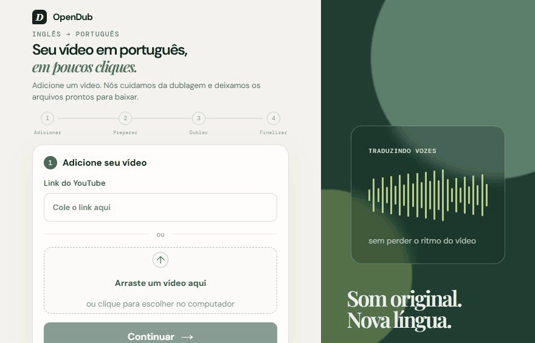

# OpenDub

Transforma um vídeo em inglês em vídeo dublado em português — sem precisar entender
nada de programação. Cole um link do YouTube ou escolha um vídeo do computador,
clique em um botão e baixe o resultado.

100% gratuito e de código aberto. Veja a [página de apresentação do projeto](https://opendub.larchertech.com)
para uma visão geral, demonstração em vídeo e o link de download.

## O que ele faz

- Traduz a fala do inglês para o português mantendo o vídeo original intacto: os
  cortes, a música e os efeitos continuam exatamente onde estavam.
- **A dublagem sai na voz da própria pessoa do vídeo** — o aplicativo usa a voz dela
  como referência, então não é aquela voz de robô.
- Também gera a legenda (`.srt`) e a transcrição (`.txt`) **em português**.

## Como usar

1. Abra o aplicativo.
2. Cole o link de um vídeo do YouTube **ou** arraste/escolha um vídeo do seu
   computador.
3. Clique em **Continuar** e depois em **Dublar meu vídeo**.
4. Espere a barra de progresso terminar. Como referência: um vídeo de 3 minutos levou
   cerca de 6 minutos, num computador com placa de vídeo de entrada.
5. Baixe o vídeo dublado. A legenda pode ser gerada e baixada assim que a dublagem
   termina, e o vídeo original fica disponível desde o começo.

Os arquivos baixados usam o nome do seu vídeo: `meu video.mp4` (original),
`meu video_dublado.mp4` e `meu video.srt`. Como a legenda tem o mesmo nome do vídeo, a
maioria dos players a reconhece sozinha.

Você pode fechar e reabrir o aplicativo no meio do processo: ele lembra do vídeo que
estava sendo dublado e retoma de onde parou.

## Baixando e instalando

Baixe o instalador na aba [Releases](../../releases) deste repositório e execute-o.
Na primeira abertura, o próprio aplicativo baixa o que precisa pra funcionar (isso
pode demorar alguns minutos e consumir alguns GB — só acontece uma vez).

**É necessária uma placa de vídeo NVIDIA.** Os modelos que reconhecem e recriam a fala
só rodam nela; sem placa o aplicativo abre e avisa, mas a dublagem não funciona.

## Quer entender por dentro?

Esse README é só o "manual de uso". A documentação técnica (arquitetura, pipeline de
tradução, API, como rodar em modo desenvolvimento) está em:

- [docs/architecture.md](docs/architecture.md) — visão geral técnica, API e distribuição.
- [docs/pipeline.md](docs/pipeline.md) — detalhes de cada etapa da dublagem.
- [docs/landing-page.md](docs/landing-page.md) — como rodar e publicar a landing page.
